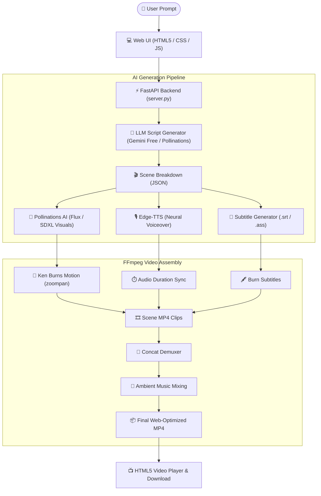

# AI Prompt-to-Video Studio

An end-to-end automated video generation system that converts text prompts into fully produced MP4 videos with scriptwriting, scene storyboarding, AI neural voiceover, high-resolution visuals, dynamic camera movement, subtitles, and ambient music mixing using **FFmpeg** and **100% Free APIs**.

---

## Key Features

1. **Prompt to Script**:
   - Accepts any text prompt or creative concept.
   - Generates a scene-by-scene script with hooks, narration, and optimized AI visual prompts.
   - Supports **Google Gemini Free API** (`gemini-1.5-flash` / `gemini-2.5-flash`), **Pollinations Free Text API** (Zero keys required), or intelligent local fallback.

2. **Neural Voiceover & Subtitles**:
   - High-fidelity natural voiceovers powered by **Microsoft Edge-TTS** (100% free, 0 API keys required).
   - 12+ voices across English (US/UK/India), Spanish, French, German, and Japanese.
   - Synchronized subtitles burned directly into the video with customizable styling (Yellow viral TikTok style, Minimal White, Cyber Cyan, Gold).

3. **AI Visual Generation**:
   - Generates scene images matching the script using **Pollinations AI** (Flux / SDXL models).
   - Generates in exact aspect ratios (16:9 Landscape for YouTube or 9:16 Portrait for Shorts/TikTok/Reels).

4. **FFmpeg Video Engine**:
   - Smooth **Ken Burns** motion (alternating camera zooms and subtle drifts).
   - Precise audio-video synchronization based on spoken duration.
   - Built-in soothing ambient background music ducked underneath the voiceover.
   - Faststart MP4 encoding for immediate web playback.

5. **Two Production Modes**:
   - ** 1-Click Fast Video**: Generates the complete MP4 video automatically in one click.
   - ** Storyboard Studio**: Generates the script and scenes first, allowing you to edit the narration, tweak visual prompts, and preview before rendering.

---

##  System Architecture



---

##  Quick Start Guide

### 1. Launch the Server
Open PowerShell in this directory and run:
```powershell
python -m uvicorn server:app --host 127.0.0.1 --port 8000 --reload
```
Or double-click:
- `run.bat` (Windows Batch)
- `run.ps1` (PowerShell)

### 2. Open the Web App
Open your browser and visit:
 **[http://127.0.0.1:8000](http://127.0.0.1:8000)**

### 3. Generate a Video
1. Enter your idea in the prompt box (or click one of the quick idea chips like *Ocean Depths* or *Brain Tricks*).
2. Choose your preferred **Aspect Ratio** (16:9 Landscape or 9:16 Vertical Reel).
3. Pick a **Narrator Voice** (you can click the preview button to listen).
4. Click **" Generate Full Video"** and watch the live progress bar and terminal logs!

---

##  Free API Keys (Zero Configuration Required!)

| Service | Provider | Cost | API Key Required? |
| :--- | :--- | :--- | :--- |
| **Script Generation** | Pollinations Text API / Fallback | 100% Free | ❌ **No Key Needed** |
| **Script Generation (Optional)** | Google Gemini (`gemini-1.5-flash`) | Free Tier | ✅ Free key from [Google AI Studio](https://aistudio.google.com/app/apikey) |
| **Voiceover (TTS)** | Microsoft Edge-TTS | 100% Free | ❌ **No Key Needed** |
| **Visuals / Artwork** | Pollinations AI (Flux / SDXL) | 100% Free | ❌ **No Key Needed** |
| **Video Assembly** | FFmpeg | Open Source | ❌ **No Key Needed (Bundled)** |

*(If you want to use your free Google Gemini API key, click **"Keys & Config"** in the top-right corner of the app and paste it in. It will be stored locally in your browser).*

---

## 📁 Project Structure

```
prompt-to-video/
├── config.py            # Global paths, voice list, styles, ffmpeg resolver
├── llm_service.py       # Script generation with Gemini / Pollinations / Fallback
├── tts_service.py       # Edge-TTS voice synthesis & SRT subtitle generation
├── image_service.py     # Pollinations AI image fetcher & canvas fallback
├── video_service.py     # FFmpeg Ken Burns motion, subtitle burning, & music mixing
├── pipeline.py          # Master orchestrator with real-time job status tracking
├── server.py            # FastAPI REST backend & static web server
├── requirements.txt     # Python dependencies
├── run.bat              # 1-click Windows batch launcher
├── run.ps1              # PowerShell launch script
├── static/
│   ├── index.html       # Responsive web UI
│   ├── style.css        # Studio dark theme & glassmorphic styling
│   └── app.js           # Frontend interactivity & real-time polling
├── output/              # Final rendered MP4 videos & metadata JSON
└── temp/                # Intermediate audio, image, and clip cache
```
